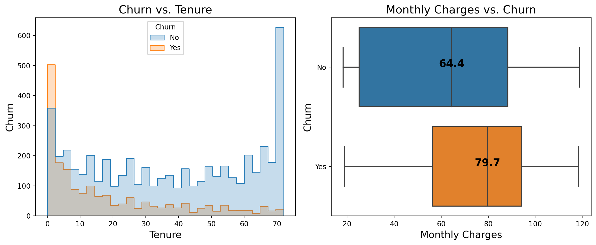
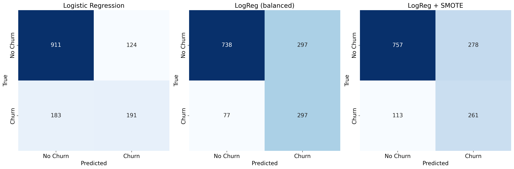
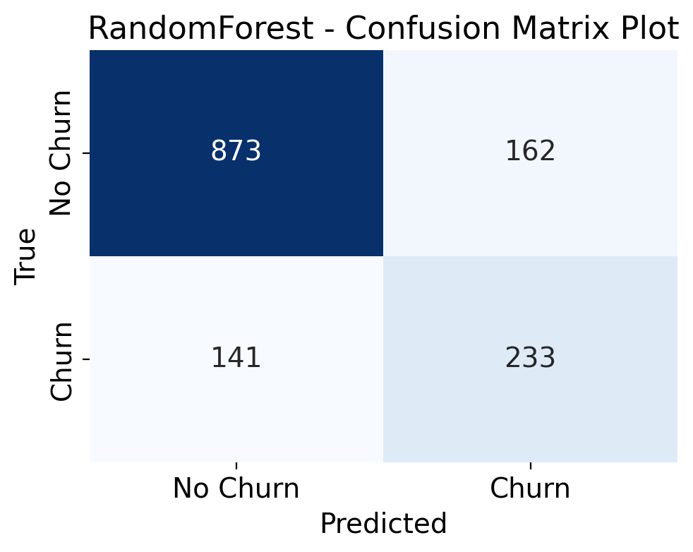
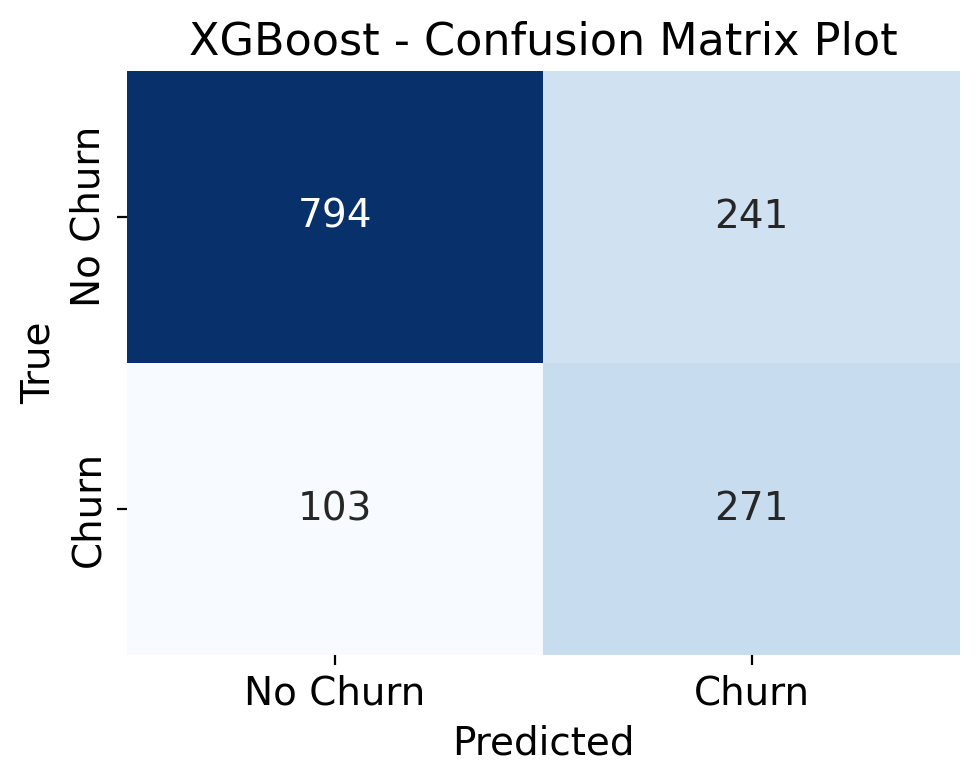
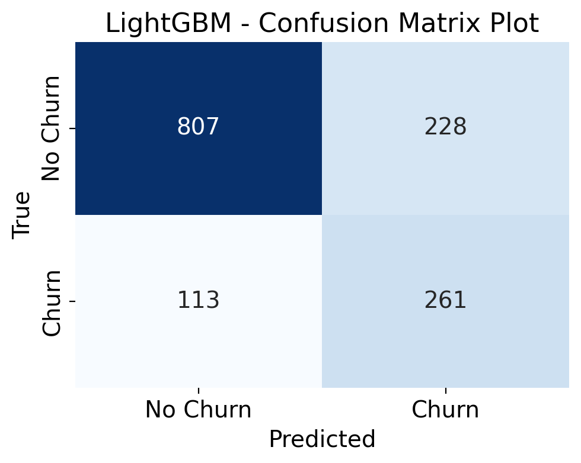

# Telco Customer Churn Prediction

## Goal
Develop machine learning models to predict whether a telecom customer will churn based on service usage and demographic data.

---

## Data
[Telco Customer Churn](https://www.kaggle.com/datasets/blastchar/telco-customer-churn)
- Customer demographics: gender, age range, partner, dependents
- Customer account: tenure, contract type, payment method, billing, charges
- Services subscribed: phone, multiple lines, internet, online security, backup, device protection, tech support, streaming TV/movies
- Churn: whether the customer left in the last month

---

## Methods
- **EDA:** 
  - Churn Distribution: About 26% of customers left (imbalanced target).
  - Tenure: Customers with shorter tenure are more likely to churn.
  - Charges: Higher monthly charges increase churn probability.
  

- **Results Comparison**

| Model               | Accuracy | Precision (Churn) | Recall (Churn) | F1 (Churn) |
|---------------------|:--------:|:-----------------:|:--------------:|:----------:|
| Logistic Regression | 0.782    | 0.606             | 0.511          | 0.554      |
| LogReg (balanced)   | 0.735    | 0.500             | 0.794          | 0.614      |
| LogReg + SMOTE      | 0.723    | 0.484             | 0.698          | 0.572      |
| Random Forest       | 0.785    | 0.590             | 0.623          | 0.610      |
| XGBoost             | 0.756    | 0.529             | 0.725          | 0.612      |
| LightGBM            | 0.759    | 0.534             | 0.698          | 0.605      |

- **Logistic Regression (baseline):**
  - Strong overall, but poor recall on minority churn class.  

- **Logistic Regression (balanced weights):**
  - Improved churn recall to 78%, but reduced precision.  

- **Logistic Regression + SMOTE**
  - Recall improved compared to baseline LogReg(70%), but precision still low.  

- **Random Forest**
  - Balanced performance (Precision 0.590, Recall 0.623).  

- **XGBoost**
  - Churn recall: 73% — stronger than Logistic Regression baseline.  

- **LightGBM**
  - Recall (70%) is similar to LogReg + SMOTE model.

---

## Results Figures

### Confusion Matrices
- Logistic Regression  
    

- Random Forest  
    

- XGBoost  
    

- LightGBM  
    

---

## Key Takeaways

- **Balanced trade-off:** Random Forest achieves the best overall balance (Accuracy 0.785, F1 0.610), outperforming logistic regression variants in handling both precision and recall.

- **High recall options:** LogReg (balanced) and XGBoost yield higher recall (0.783 and 0.725), making them more suitable if capturing most churn cases is critical, though at the cost of precision and accuracy.

- **Modeling insight:** Simple Logistic Regression performs reasonably well, but tree-based methods (Random Forest, XGBoost, LightGBM) consistently provide stronger recall–precision balance for churn prediction.
