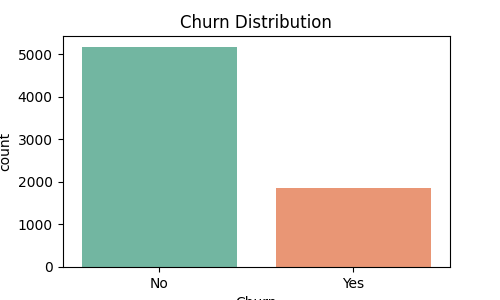
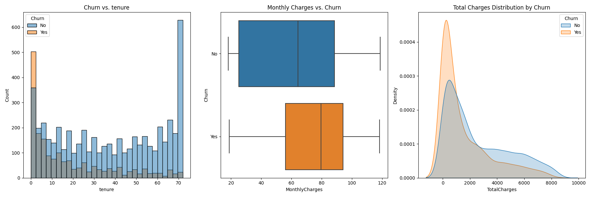
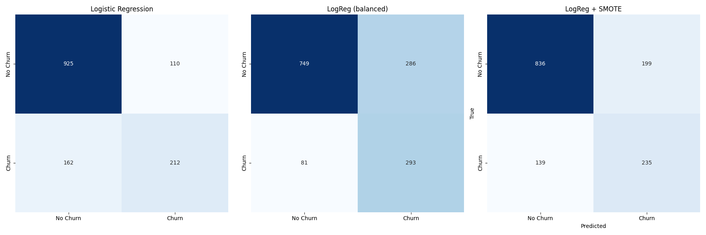
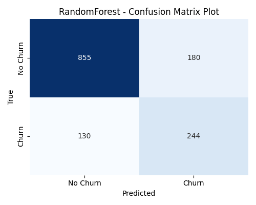

# Telco Customer Churn Prediction

## Introduction

**Goal**  
Develop machine learning models to predict whether a telecom customer will churn based on service usage and demographic data.

**Business Context**  
Customer churn is a critical challenge for telecom providers. Identifying at-risk customers allows companies to take proactive actions (e.g., promotions, contract adjustments), reducing revenue loss and improving retention.

---

## Exploratory Data Analysis (EDA)

- **Churn Distribution**: About 26% of customers left (imbalanced target).  
- **Tenure**: Customers with shorter tenure are more likely to churn.  
- **Charges**: Higher monthly charges increase churn probability.  
- **Contract Type**: Month-to-month contracts are highly correlated with churn.  

  

  

---

## Models & Experiments

We compared baseline models (Logistic Regression) with advanced ensemble methods (Random Forest, XGBoost).  
To address class imbalance, we tested **class weighting** and **SMOTE oversampling**.

### 1. Logistic Regression (baseline)
- Accuracy: **0.807**
- Precision (churn): 0.658, Recall (churn): 0.567  
- Strong overall, but poor recall on minority churn class.  

### 2. Logistic Regression (balanced weights)
- Accuracy: 0.739  
- Improved churn recall to 78%, but reduced precision and accuracy.  

### 3. Logistic Regression + SMOTE
- Accuracy: 0.760  
- Recall improved (63%), but precision still modest.  

### 4. XGBoost
- Accuracy: 0.762  
- Churn recall: 69% — stronger than Logistic Regression baseline.  

### 5. Random Forest
- Accuracy: **0.780**  
- Balanced performance (Precision 0.576, Recall 0.652).  
- Best overall trade-off between accuracy and churn detection.  

---

## Results Comparison

| Model | Accuracy | Precision (Churn) | Recall (Churn) | F1 (Churn) |
| --- | --- | --- | --- | --- |
| Logistic Regression | 0.807 | 0.658 | 0.567 | 0.609 |
| LogReg (balanced) | 0.739 | 0.506 | **0.783** | 0.615 |
| LogReg + SMOTE | 0.760 | 0.542 | 0.628 | 0.582 |
| XGBoost | 0.762 | 0.540 | 0.690 | 0.606 |
| Random Forest | **0.780** | 0.576 | 0.652 | 0.612 |

---

## Visualizations

### Confusion Matrices
- Logistic Regression  
    

- XGBoost  
    

- Random Forest  
    

---

## Key Takeaways

- Logistic Regression is a solid baseline but underperforms on minority churn cases.  
- Class balancing methods (weights, SMOTE) improve recall, but trade off accuracy.  
- Tree-based models (Random Forest, XGBoost) provide stronger balance, with **Random Forest** delivering the most stable performance overall.  
